<!--
    ┌──────────────────────────────────────────────────────────────┐
    │  You read raw source. Respect.                               │
    │                                                              │
    │  Transmission for source-readers: the satellite in the       │
    │  header completes one orbit every 16 seconds. That is        │
    │  ~5,400 orbits a day it flies, whether anyone watches        │
    │  or not. Be like the satellite.                              │
    │                                                              │
    │  Say hi: avivek@andrew.cmu.edu                               │
    └──────────────────────────────────────────────────────────────┘
-->

<picture>
  <source media="(prefers-color-scheme: dark)" srcset="assets/header-dark.svg">
  <source media="(prefers-color-scheme: light)" srcset="assets/header-light.svg">
  
</picture>

<div align="center">

<picture>
  <source media="(prefers-color-scheme: dark)" srcset="https://readme-typing-svg.demolab.com/?font=JetBrains+Mono&weight=600&size=17&duration=3200&pause=900&center=true&vCenter=true&width=640&height=34&color=FFB454&background=00000000&lines=ICPC+World+Finals+2026+%C2%B7+Carnegie+Mellon;Shipping+production+systems+%40+Vidi+%C2%B7+London;Olympiad-level+LLM+reasoning+data+%40+Mercor;I+build%2C+I+compete%2C+I+ship.">
  
</picture>

<br>

<a href="https://web2.qatar.cmu.edu/~avivek/"></a>
<a href="https://www.linkedin.com/in/aditya-vivek-53b7a827a/"></a>
<a href="mailto:avivek@andrew.cmu.edu"></a>
</div>

<br>

## `> mission briefing`

```cpp
// adicmu.cpp : self-describing header, zero dependencies
#include <array>

struct AdityaVivek {
    static constexpr const char* base    = "Carnegie Mellon University, Doha";
    static constexpr const char* study   = "B.S. Computer Science, Class of 2029";
    static constexpr double      gpa     = 3.78;

    static constexpr std::array<const char*, 3> now {
        "SWE Intern @ Vidi              // travel-tech, London",
        "SWE Intern @ Carnegie Mellon   // CountsFor curriculum platform",
        "LLM reasoning data @ Mercor",
    };

    static constexpr const char* compete = "ICPC World Finals 2026";
};  // no bugs, only undocumented features
```

## `> tech arsenal`

<div align="center">

**languages**<br>


**frameworks & ML**<br>


**infrastructure**<br>


</div>

## `> medal cabinet` <sub>winning is fun</sub>

| | Contest | Result |
|---|---|---|
| 🥈 | **Africa & Arab Collegiate Programming Contest** · Luxor 🇪🇬 2025 | Silver → **qualified for ICPC World Finals 2026** |
| 🥇 | **Qatar Collegiate Programming Contest** · Doha 🇶🇦 2025 | Gold · **1st of 133 teams** nationwide |
| 💎 | **International Scientific Physics Olympiad** · Russia 🇷🇺 2024 | Diamond Award · best performer, Qatar national team |
| 🥉 | **International Nuclear Science Olympiad** · 🇲🇾 2025 & 🇵🇭 2024 | Bronze ×2, representing Qatar |

## `> contribution orbit`

<picture>
  <source media="(prefers-color-scheme: dark)" srcset="https://raw.githubusercontent.com/Adicmu/Adicmu/output/snake-dark.svg">
  
</picture>

<picture>
  <source media="(prefers-color-scheme: dark)" srcset="https://github-readme-activity-graph.vercel.app/graph?username=Adicmu&bg_color=00000000&hide_border=true&color=9FB0CC&line=FFB454&point=FFD9A0&area=true&area_color=FFB454&custom_title=ORBITAL%20TELEMETRY%20%C2%B7%20CONTRIBUTION%20ALTITUDE">
  
</picture>

<details>
<summary><code>> flight recorder</code> <sub>declassified extras</sub></summary>
<br>

- The CountsFor data pipeline made **110 commits over 78 days** without me touching it. My most reliable coworker.
- I've collected medals on three continents: Africa 🇪🇬, Europe 🇷🇺, and Asia 🇲🇾🇵🇭.
- I once cut an API bill from **$654 to $32** and got *better* coverage. Still my favorite pull request.
- 2,000,000,000+ celestial detections passed through my NASA/IASC processing runs. None of them starred this profile.
- My portfolio renders a 3D starfield in Three.js. This README is its 2D little sibling.

</details>

<picture>
  <source media="(prefers-color-scheme: dark)" srcset="assets/footer-dark.svg">
  <source media="(prefers-color-scheme: light)" srcset="assets/footer-light.svg">
  
</picture>
